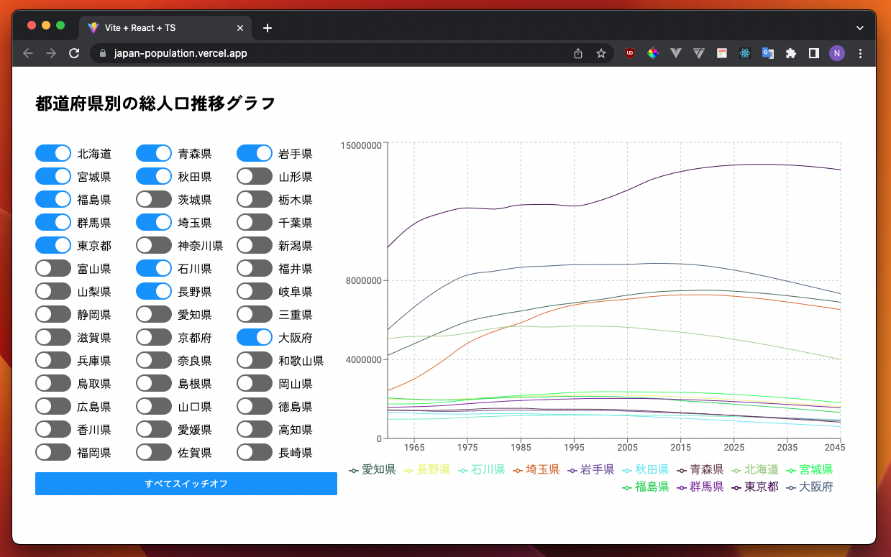

# React + TypeScript + Vite

Japan's population by prefectures (1960 - 2045)

API Source: [RESAS](https://opendata.resas-portal.go.jp/)

<!-- Image Preview.png in public folder -->

## Demo

https://japan-population.vercel.app/

## Environment Setup

Create RESAS Account and get your API Key here: https://opendata.resas-portal.go.jp/form.html

Create `.env` file in root folder and add the following variables:

```env
VITE_VERCEL_ENV_API_KEY=<your-api-key>
```

## Install dependencies

```bash
npm install
```

## Run App with Vite

```bash
npm run dev
```

## Compiles and minifies for production

```bash
npm run build
```

## Preview the built app

```bash
npm run preview
```

## Format the code

```bash
npm run format
```

## Lints and fixes files

```bash
npm run lint
```

```bash
npm run lint:fix
```
